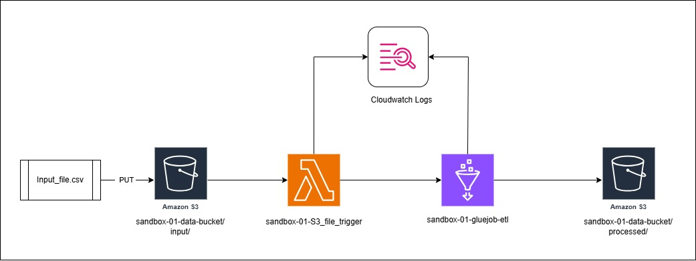

# Automate AWS Glue Job Execution Using S3 Event-Based Triggers

Design and implement an automated data ingestion workflow that triggers an AWS Glue ETL job upon the upload of a new CSV file to a designated Amazon S3 bucket. This system should leverage S3 event notifications, AWS Lambda, and AWS Glue, enabling near real-time data processing without manual intervention.

For the implementation of this workflow, I have leveraged the AWS free tier account and used required AWS services to implement the data ingestion workflow.

## **1. 📈 Architecture Overview**


Architecture Diagram

**Flow:**

1. **File Upload**
    
    ➔ A CSV file (`Input_file.csv`) is uploaded to **Amazon S3** under path: `sandbox-01-data-bucket/input/`
    
2. **Trigger Lambda**
    
    ➔ Upload triggers **Lambda Function** (`sandbox-01-S3_file_trigger`).
    
3. **Lambda Starts Glue Job**
    
    ➔ Lambda starts an **AWS Glue Job** (`sandbox-01-gluejob-etl`).
    
4. **Data Processing**
    
    ➔ Glue job reads, cleans, transforms the data.
    
5. **Store Output**
    
    ➔ Processed data is written back to **S3** under path: `sandbox-01-data-bucket/processed/`.
    
6. **Monitoring**
    
    ➔ Logs of both Lambda and Glue are sent to **CloudWatch Logs**.
    

## **2. 🖥️ Lambda Function (`sandbox-01-S3_file_trigger`)**

**Purpose:**

Trigger an AWS Glue ETL job when a new file arrives in S3.

**Key Steps:**

- Trigger function from S3 Events received for PUT object in path `sandbox-01-data-bucket/input/`
- Starts the Glue job `sandbox-01-gluejob-etl`.
- Passes input/output bucket info as arguments.
- Monitors the job until it completes (`SUCCEEDED`, `FAILED`, or `STOPPED`).
- S3 events trigger configuration
    - `Bucket arn: arn:aws:s3:::sandbox-01-data-bucket
    Event types: s3:ObjectCreated:Put
    isComplexStatement: No
    Notification name: 943f045d-8015-4132-8fce-661c6a7f2866
    Prefix: input/
    Service principal: http://s3.amazonaws.com
    Source account: 242352503086
    Statement ID: lambda-da915304-1951-4488-b95b-1a9ac8649451
    Suffix: .csv`


```python
import json
import boto3
glue_client = boto3.client('glue')
def lambda_handler(event, context):
    try:
# Extract bucket and object details
        print(event)
        record = event['Records'][0]
        bucket_name = record['s3']['bucket']['name']
        object_key = record['s3']['object']['key']
        print(f"Triggered by bucket: {bucket_name}, key: {object_key}")
# Start the Glue job
        response = glue_client.start_job_run(
            JobName='sandbox-01-gluejob-etl',
            Arguments={
                '--s3_input_bucket': bucket_name,
                '--s3_input_key': 'input',
                '--s3_output_bucket': bucket_name,
                '--s3_output_prefix': 'processed'
            },
            WorkerType='G.1X',
            NumberOfWorkers=2
        )
        job_run_id = response['JobRunId']
        print(f"Started Glue job with JobRunId: {job_run_id}")
# Polling the Glue job until it finishes
        while True:
            job_status = glue_client.get_job_run(JobName='sandbox-01-gluejob-etl', RunId=job_run_id)
            state = job_status['JobRun']['JobRunState']
            if state in ['SUCCEEDED', 'FAILED', 'STOPPED']:
                print(f"Glue job finished with state: {state}")
                break
            else:
                print(f"Glue job still running... Current state: {state}")
        return {
            'statusCode': 200,
            'body': json.dumps(f"Glue Job {job_run_id} completed with state: {state}")
        }
    except Exception as e:
        print(f"Error: {str(e)}")
        return {
            'statusCode': 500,
            'body': json.dumps(f"Error occurred: {str(e)}")
```

**Error Handling:**

Captures and logs any exceptions and returns a `500` error if needed.

## **3. 🛠️ Glue Job (`sandbox-01-gluejob-etl`)**

**Purpose:**

A parameterized Glue job to process the uploaded file dynamically with, like read the CSV file, clean, transform, enrich it, and write the processed output back to S3.

**Sample Data :**

| id | name | email | date | amount | status |
| --- | --- | --- | --- | --- | --- |
| 1 | John Doe | [john.doe@example.com](mailto:john.doe@example.com) | 01-04-2025 | 125.5 | active |
| 2 | Jane Smith | [jane.smith@example.com](mailto:jane.smith@example.com) | 02-04-2025 | 75.25 | pending |
| 3 | Robert Johnson | [robert.j@example.com](mailto:robert.j@example.com) | 02-04-2025 | 220 | active |
| 4 | Emily Davis | [emily.davis@example.com](mailto:emily.davis@example.com) | 03-04-2025 | 50.75 | inactive |
| 5 | Michael Brown | [michael.b@example.com](mailto:michael.b@example.com) | 03-04-2025 | 175.25 | active |
| 6 | Sarah Wilson | [sarah.w@example.com](mailto:sarah.w@example.com) | 04-04-2025 | 95.5 | pending |
| 7 | David Miller | [david.m@example.com](mailto:david.m@example.com) | 04-04-2025 | 150 | active |
| 8 | Lisa Taylor | [lisa.t@example.com](mailto:lisa.t@example.com) | 05-04-2025 | 85.75 | inactive |
| 9 | James Anderson | [james.a@example.com](mailto:james.a@example.com) | 05-04-2025 | 210.25 | active |
| 10 | Jennifer White | [jennifer.w@example.com](mailto:jennifer.w@example.com) | 06-04-2025 | 110.5 | pending |

**Key Operations:**

- **Getting data source and target (S3) path as parameters.**
- **Enabling job bookmarking via dynamic frame. (Only process new or modified files from source. )**
- **Data Cleaning:**
    - Trim and standardize `name`.
    - Validate `email`.
    - Convert `date` to `DateType`.
    - Standardize and cast `amount`.
    - Normalize `status` to lowercase.
- **Data Transformation:**
    - Add `processing_date` and `source_file`.
    - Calculate `running_total_by_status`.
    - Categorize `amount` as `low`, `medium`, `high`.
    - Flag rows with invalid emails.
- **Output:**
    - Save cleaned & enriched CSV output to:
        
        `sandbox-01-data-bucket/processed/`
        
    - Save JSON processing statistics under:
        
        `sandbox-01-data-bucket/processed/stats/`
        

**Example Transformation Output Columns:**

| Column Name | Description |
| --- | --- |
| id | Unique ID from source |
| name | Cleaned customer name |
| email | Original email address |
| email_valid | True/False for email validation |
| date | Parsed date |
| amount | Cleaned numeric amount |
| amount_category | Categorized amount (`low`, `medium`, `high`) |
| status | Cleaned status |
| running_total_by_status | Running total grouped by status |
| data_quality_issues | Flags like "Invalid email" |
| processing_date | Timestamp of processing |
| source_file | Name of source input file |

```python
import sys
from awsglue.transforms import *
from awsglue.utils import getResolvedOptions
from pyspark.context import SparkContext
from awsglue.context import GlueContext
from awsglue.job import Job
import datetime
from pyspark.sql import functions as F
from pyspark.sql.types import DoubleType
from pyspark.sql.window import Window
sc = SparkContext()
glueContext = GlueContext(sc)
spark = glueContext.spark_session
LOGGER = glueContext.get_logger()
job = Job(glueContext)
args = getResolvedOptions(
    sys.argv,
    ['JOB_NAME', 's3_input_bucket', 's3_input_key', 's3_output_bucket', 's3_output_prefix']
)
job.init(args['JOB_NAME'], args)
input_path = f"s3://{args['s3_input_bucket']}/{args['s3_input_key']}"
LOGGER.info(f"Starting processing for file: {input_path}")
try:
    current_time = datetime.datetime.now().strftime("%Y%m%d_%H%M%S")
    file_name = args['s3_input_key'].split('/')[-1].replace('.csv', '')
    LOGGER.info(f'File name: {file_name}')
    datasource = glueContext.create_dynamic_frame.from_options(
        connection_type="s3",
        connection_options={
            "paths": [input_path],
        },
        format="csv",
        format_options={"withHeader": True},
        transformation_ctx='datasource'
    )
    raw_df = datasource.toDF()
    LOGGER.info("Original schema:")
    raw_df.printSchema()
    LOGGER.info("Sample raw records:")
    raw_df.show(5, truncate=False)
    input_count = raw_df.count()
    LOGGER.info(f"Input record count: {input_count}")
    if input_count > 0:
# -------------------- DATA CLEANING PHASE --------------------
        LOGGER.info("Starting data cleaning phase...")
# 1. Clean up name field - trim whitespace and convert to proper case
        cleaned_df = raw_df.withColumn("name", F.initcap(F.trim(F.col("name"))))
# 2. Validate and standardize email addresses
        cleaned_df = cleaned_df.withColumn("email_valid",
                                          F.when(F.col("email").rlike("^[a-zA-Z0-9._%+-]+@[a-zA-Z0-9.-]+\\.[a-zA-Z]{2,6}$"), True)
                                           .otherwise(False))
# 3. Convert date strings to proper date type
        cleaned_df = cleaned_df.withColumn("date", F.to_date(F.col("date"), "yyyy-MM-dd"))
# 4. Clean and convert amount to proper decimal/double
        cleaned_df = cleaned_df.withColumn("amount",
                                          F.regexp_replace(F.col("amount"), "[^0-9.]", ""))# Remove non-numeric chars except decimal
        cleaned_df = cleaned_df.withColumn("amount", F.col("amount").cast(DoubleType()))
# 5. Standardize status values to lowercase
        cleaned_df = cleaned_df.withColumn("status", F.lower(F.trim(F.col("status"))))
        LOGGER.info("Sample data after cleaning:")
        cleaned_df.show(5, truncate=False)
        clean_count = cleaned_df.count()
        LOGGER.info(f"Records after cleaning: {clean_count}")
        if input_count != clean_count:
            LOGGER.info(f"Removed {input_count - clean_count} duplicate or invalid records during cleaning")
# -------------------- TRANSFORMATION PHASE --------------------
        LOGGER.info("Starting data transformation phase...")
# 1. Add processing metadata
        transformed_df = cleaned_df.withColumn("processing_date", F.current_timestamp()) \
                                  .withColumn("source_file", F.lit(args['s3_input_key']))
# 2. Calculate a running total of amount by date and status
        window_spec = Window.partitionBy("status").orderBy("date").rowsBetween(Window.unboundedPreceding, 0)
        transformed_df = transformed_df.withColumn("running_total_by_status",
                                                  F.sum("amount").over(window_spec))
# 3. Categorize amounts
        transformed_df = transformed_df.withColumn("amount_category",
                                                  F.when(F.col("amount") < 100, "low")
                                                   .when((F.col("amount") >= 100) & (F.col("amount") < 200), "medium")
                                                   .otherwise("high"))
# 4. Flag email issues
        transformed_df = transformed_df.withColumn("data_quality_issues",
                                                  F.when(F.col("email_valid") == False, "Invalid email")
                                                   .otherwise(None))
        LOGGER.info("Final transformed schema:")
        transformed_df.printSchema()
        LOGGER.info("Sample data after transformation:")
        transformed_df.show(5, truncate=False)
        output_count = transformed_df.count()
        LOGGER.info(f"Output record count: {output_count}")
# -------------------- OUTPUT PHASE --------------------
        final_df = transformed_df.select(
            "id", "name", "email", "email_valid", "date",
            "amount", "amount_category", "status", "running_total_by_status",
            "data_quality_issues", "processing_date", "source_file"
        )
        transformed_output_path = f"s3://{args['s3_output_bucket']}/{args['s3_output_prefix']}/{file_name}_{current_time}"
        final_df.write \
            .mode("overwrite") \
            .option("header", "true") \
            .csv(transformed_output_path)
        LOGGER.info(f"Successfully written transformed data to: {transformed_output_path}")
        stats_df = spark.createDataFrame([
            (input_path, input_count, clean_count, output_count,
             datetime.datetime.now().strftime("%Y-%m-%d %H:%M:%S"))
        ], ["source_file", "input_count", "cleaned_count", "output_count", "processing_timestamp"])
        stats_output_path = f"s3://{args['s3_output_bucket']}/{args['s3_output_prefix']}/stats/{file_name}_{current_time}"
        stats_df.write \
            .mode("overwrite") \
            .option("header", "true") \
            .json(stats_output_path)
        LOGGER.info(f"Successfully written processing statistics to: {stats_output_path}")
        LOGGER.info("Glue job completed successfully.")
    job.commit()
    LOGGER.info("Glue job completed successfully.")
except Exception as e:
    LOGGER.error(f"Error occurred during Glue job: {str(e)}")
    import traceback
    LOGGER.error(traceback.format_exc())
    raise e
```

## **4. 🔒 IAM Setup**

### **Glue Job Role Policy (`sandbox-01-glue-role`)**

**Purpose:**

Allow AWS Glue job to read/write S3 data, manage logs, and access Glue resources.

```json
{
    "Version": "2012-10-17",
    "Statement": [
        {
            "Effect": "Allow",
            "Action": [
                "s3:GetObject",
                "s3:PutObject",
                "s3:DeleteObject",
                "s3:ListBucket"
            ],
            "Resource": [
                "arn:aws:s3:::sandbox-01-data-bucket",
                "arn:aws:s3:::sandbox-01-data-bucket/*"
            ]
        },
        {
            "Effect": "Allow",
            "Action": [
                "logs:CreateLogGroup",
                "logs:CreateLogStream",
                "logs:PutLogEvents"
            ],
            "Resource": "arn:aws:logs:*:*:*"
        },
        {
            "Effect": "Allow",
            "Action": [
                "glue:*"
            ],
            "Resource": [
                "arn:aws:glue:*:*:catalog",
                "arn:aws:glue:*:*:database/*",
                "arn:aws:glue:*:*:table/*",
                "arn:aws:glue:*:*:userDefinedFunction/*"
            ]
        }
    ]
}
```

**Summary of Permissions:**

- Full S3 access to the `sandbox-01-data-bucket`
- Full logging permissions (CloudWatch)
- Full Glue access for catalog, databases, tables, UDFs

### **Lambda Function Role Policy (`sandbox-01-lambda-role`)**

**Purpose:**

Allow Lambda to trigger the Glue job and log events.

```json
{
    "Version": "2012-10-17",
    "Statement": [
        {
            "Effect": "Allow",
            "Action": [
                "logs:CreateLogGroup",
                "logs:CreateLogStream",
                "logs:PutLogEvents"
            ],
            "Resource": "arn:aws:logs:*:*:*"
        },
        {
            "Effect": "Allow",
            "Action": [
                "s3:GetObject",
                "s3:ListBucket"
            ],
            "Resource": [
                "arn:aws:s3:::sandbox-01-data-bucket",
                "arn:aws:s3:::sandbox-01-data-bucket/*"
            ]
        },
        {
            "Effect": "Allow",
            "Action": [
                "glue:StartJobRun",
                "glue:GetJobRun",
                "glue:GetJobRuns",
                "glue:BatchStopJobRun"
            ],
            "Resource": "arn:aws:glue:*:*:job/sandbox-01-gluejob-etl"
        }
    ]
}
```

**Summary of Permissions:**

- Read-only S3 access for the input bucket
- Ability to start and monitor the Glue ETL job
- Logging to CloudWatch

## **5. Test Cases**

| **#** | **Test Case** | **Description** | **Expected Result** |
| --- | --- | --- | --- |
| 1 | Upload a single unprocessed file | Upload a brand-new file that the Glue job has never seen. |  File is processed successfully. Processed output appears in the correct output S3 location. |
| 2 | Upload multiple unprocessed files | Upload multiple new files at once to test bulk ingestion. |  All files are processed in bulk, no multiple glue job run for individual file. |
| 3 | Upload already processed file (with changes ) | Re-upload the file with any modifications. | Glue job will track based on last modification timestamp of file, if last modification timestamp changed then it will take up for processing. |